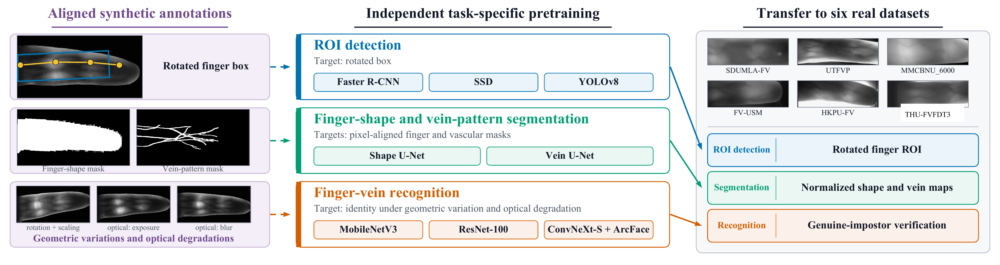

# NormVein

Official pretrained models and training code for **NormVein: Normalizing
Finger-Vein Tasks with Large-Scale Synthetic Pretraining**.

This repository has two purposes:

1. Download NormVein pretrained models and use them for downstream tasks.
2. Train the pretrained models from scratch with
   [FingerVeinSyn-5M](https://github.com/EvanWang98/FingerVeinSyn-5M).



## Installation

```bash
git clone https://github.com/EvanWang98/NormVein.git
cd NormVein
pip install -e .
```

## Use pretrained models

The pretrained models are available in the
[GitHub Release](https://github.com/EvanWang98/NormVein/releases/tag/v0.1.0-candidate.1).

| Task | Model ID | File |
|---|---|---|
| ROI detection | `roi_rotated_faster_rcnn_r50_fpn` | `normvein_roi_rotated_faster_rcnn_r50_fpn.pth` |
| ROI detection | `roi_rotated_ssd_r50_fpn` | `normvein_roi_rotated_ssd_r50_fpn.pth` |
| ROI detection | `roi_rotated_yolo_r50_fpn` | `normvein_roi_rotated_yolo_r50_fpn.pth` |
| Finger-shape segmentation | `seg_finger_shape_unet_r50` | `normvein_seg_finger_shape_unet_r50.pth` |
| Vein-pattern segmentation | `seg_vein_pattern_unet_r50` | `normvein_seg_vein_pattern_unet_r50.pth` |
| Recognition | `rec_mobilefacenet_large` | `normvein_rec_mobilefacenet_large.pth` |
| Recognition | `rec_iresnet100` | `normvein_rec_iresnet100.pth` |
| Recognition | `rec_convnext_small` | `normvein_rec_convnext_small.pth` |

Download and verify the files:

```bash
gh release download v0.1.0-candidate.1 --repo EvanWang98/NormVein --pattern "*.pth" --dir weights
gh release download v0.1.0-candidate.1 --repo EvanWang98/NormVein --pattern "manifest.json" --dir weights --clobber
python scripts/verify_weights.py
```

Use a recognition model:

```bash
normvein recognize --model rec_iresnet100 --checkpoint weights/normvein_rec_iresnet100.pth --input roi.png --output embedding.npy
```

Use a segmentation model:

```bash
normvein segment --model seg_vein_pattern_unet_r50 --checkpoint weights/normvein_seg_vein_pattern_unet_r50.pth --input roi.png --output mask.png
```

Use an ROI detection model:

```bash
normvein detect --model roi_rotated_faster_rcnn_r50_fpn --checkpoint weights/normvein_roi_rotated_faster_rcnn_r50_fpn.pth --input finger.png --output detection.json
```

## Train from scratch with FingerVeinSyn-5M

Download [FingerVeinSyn-5M](https://github.com/EvanWang98/FingerVeinSyn-5M)
and arrange it as follows:

```text
FingerVeinSyn-5M/
├── raw_images/<identity>/*.png
├── roi_images/<identity>/*.png
├── annotations/<identity>/*.xml
├── shape_masks/<identity>/*.png
└── pattern_masks/<identity>/*.png
```

Prepare the recognition and detection data:

```bash
python scripts/prepare_recognition_subset.py --data-root /data/FingerVeinSyn-5M --identities 10000 --images-per-identity 50 --output data/recognition.json
python scripts/prepare_detection_data.py --dataset-root /data/FingerVeinSyn-5M --out-dir data/detection --limit 500000
```

Train a recognition model:

```bash
python scripts/train_recognition.py --data-root /data/FingerVeinSyn-5M/roi_images --manifest data/recognition.json --model rec_mobilefacenet_large
```

Train a segmentation model:

```bash
python scripts/train_segmentation.py --data-root /data/FingerVeinSyn-5M --task vein-pattern
```

Train an ROI detection model:

```bash
python scripts/train_detection.py --ann-file data/detection/annotations/train.json --image-root /data/FingerVeinSyn-5M/raw_images --model roi_rotated_faster_rcnn_r50_fpn
```

The trained files are written to `runs/` and can be used by the same inference
commands above.

## Citation

```bibtex
@article{wang2026normvein,
  title={NormVein: Normalizing Finger-Vein Tasks with Large-Scale Synthetic Pretraining},
  author={Wang, Yifan and Gui, Jie and Bi, Yuquan and Chen, Changsheng and Qiu, Luyi and Kot, Alex},
  year={2026}
}

@inproceedings{wang2025fingerveinsyn,
  title={FingerVeinSyn-5M: A Million-Scale Dataset and Benchmark for Finger Vein Recognition},
  author={Wang, Yifan and Gui, Jie and Yu, Baosheng and Li, Qi and Sun, Zhenan and Kannala, Juho and Zhao, Guoying},
  booktitle={Proceedings of the 33rd ACM International Conference on Multimedia},
  pages={13038--13045},
  year={2025}
}
```

## Contact

- Yifan Wang: [230239767@seu.edu.cn](mailto:230239767@seu.edu.cn)
- Jie Gui: [guijie@seu.edu.cn](mailto:guijie@seu.edu.cn)

## License

[MIT License](LICENSE).
